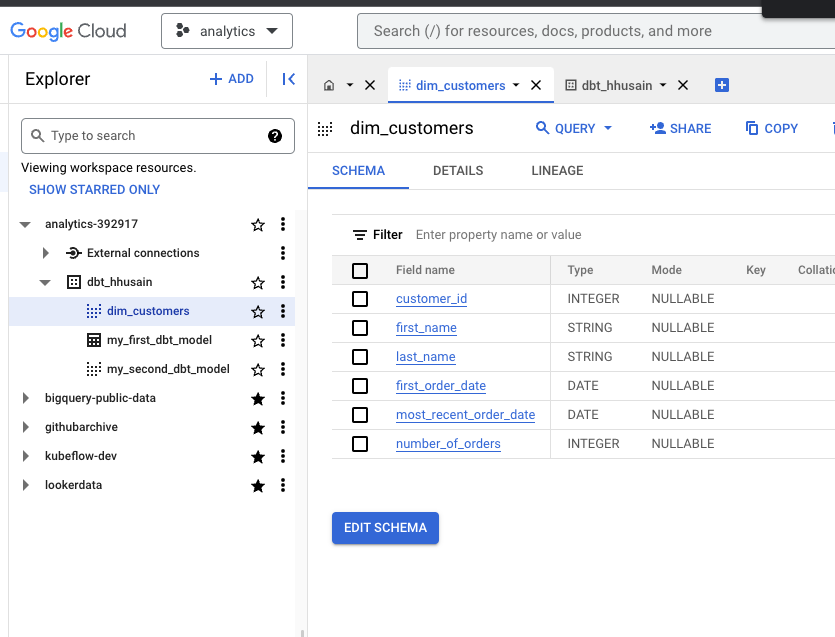
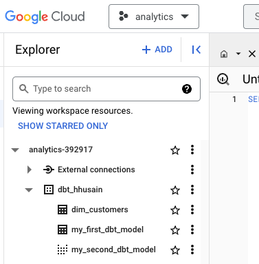
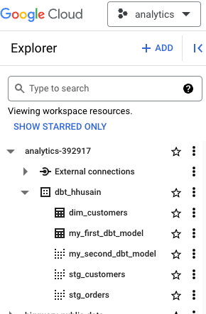
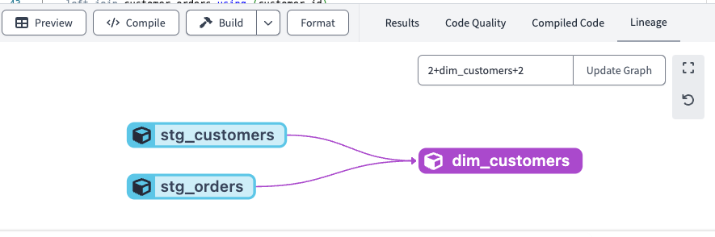

# dbt Notes

## Setup

- Setting up dbt cloud to work with BigQuery is pretty tricky using their docs.  I found this [playlist](https://www.youtube.com/playlist?list=PL0QYlrC86xQlp-eOGzGllDxYese4Ki_6A) to be better.
- I tried the quickstart but didn't really benefit much from it.  I found [this course](https://courses.getdbt.com/courses/take/fundamentals) and it was much better.

## Building your first model

We can run the below query in BigQuery, which is a data transformation using SQL. 


```sql
with customers as (

    select
        id as customer_id,
        first_name,
        last_name

    from dbt-tutorial.jaffle_shop.customers

),

orders as (

    select
        id as order_id,
        user_id as customer_id,
        order_date,
        status

    from dbt-tutorial.jaffle_shop.orders

),

customer_orders as (

    select
        customer_id,

        min(order_date) as first_order_date,
        max(order_date) as most_recent_order_date,
        count(order_id) as number_of_orders

    from orders

    group by 1

),


final as (

    select
        customers.customer_id,
        customers.first_name,
        customers.last_name,
        customer_orders.first_order_date,
        customer_orders.most_recent_order_date,
        coalesce(customer_orders.number_of_orders, 0) as number_of_orders

    from customers

    left join customer_orders using (customer_id)

)

select * from final
```

Save the above SQL into dbt cloud as `models/dim_customers.sql`. You can preview it but also run `dbt run`, which will create a view.  If we look at the detailed logs you will see something that looks like this:

```
 create or replace view `analytics-392917`.`dbt_hhusain`.`dim_customers`
  OPTIONS()
  as with customers as (
    ...
```

If we navigate to BigQuery, we will see this view:



If you want to create a table instead of a view, you have to edit the config block, which is special dbt code to the top of the SQL file:


```sql
--models/dim_customers.sql
{{
    config(
        materialized='table'
    )
}}
```

Now if you run `dbt run` again, you will see from the logs that it creates a table instead of a view:

```
create or replace table `analytics-392917`.`dbt_hhusain`.`dim_customers`
    ...
```


Now we can see that the view is now a table named `dim_customers`:



When you run `dbt run`, it runs all models in your project. If you only want to run a specific model, you can run `dbt run --select dim_customers`.

## Modularity

We can break up the above SQL into separate files.  We can create a file called `models/stg_customers.sql` and paste the following SQL into it:

```sql
with customers as (

    select
        id as customer_id,
        first_name,
        last_name

    from dbt-tutorial.jaffle_shop.customers
)

select * from customers
```

We can do the same thing with orders and create the file `models/stg_orders.sql`:

```sql
with orders as (

    select
        id as order_id,
        user_id as customer_id,
        order_date,
        status

    from dbt-tutorial.jaffle_shop.orders

),

select * from orders
```

We can now refactor `models/dim_customers.sql` to use the above two files:

```sql
--models/dim_customers.sql
{{
    config(
        materialized='table'
    )
}}

with customers as (
    select *from {{ ref('stg_customers') }}
),

orders as (
    select * from {{ ref('stg_orders') }}
),
...
```

Now if we run `dbt run`, we will see that it creates the `stg_customers` and `stg_orders` views and then creates the `dim_customers` table.



If you look at the lineage view in the dbt cloud, you will see that `dim_customers` depends on `stg_customers` and `stg_orders`:



